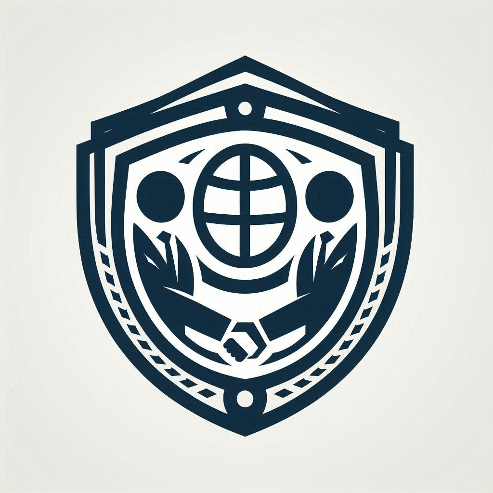

<!-- PROJECT LOGO -->

    
  <h1 align="center"><b>TRUSTED ALLY</b></h1>
  

    Together Towards a Brighter Future
  

## With a Vision for Tomorrow's Leaders

by, **<a href="">MJ-AHMAD</a>**

<!-- TABLE OF CONTENTS -->

  
T-Ally

  <ol>
    <li>
      <a href="#about-us">About Us</a>
      <ul>
        <li><a href="#vision">Vision</a></li>
          <li><a href="#our-mission">Our Mission</a></li>
      </ul>
    </li>
    <li>
      <a href="#our-work">Our Work</a>
      <ul>
        <li><a href="#products">Products</a></li>
        <li><a href="#specialties-of-trusted-ally">Specialties</a></li>
      </ul>
    </li>
    <li><a href="#Specialties">Specialties</a></li>
    <li><a href="#Industry & Type">Industry & Type</a></li>
    <li><a href="#Vision for the Future">Vision for the Future</a></li>
    <li><a href="#Our Work">Our Work</a></li>
    <li><a href="#Products">Products</a></li>
    <li><a href="#Investor">Investor</a></li>
    <li><a href="#Contact">Contact</a></li>
    <li><a href="#Our Opportunity and Responsibility">Our Opportunity and Responsibility</a></li>
  </ol>

## About Us

**TRUSTED-ALLY** is dedicated to building a brighter future for all through education, empowerment, and innovation. Our work is a testament to our commitment to creating a positive and lasting impact on society.

## Vision

At TRUSTED-ALLY, we believe in shaping a better and enlightened society through education and innovation. Our vision is to lead by example, fostering a community where businesses thrive, communities grow, and education flourishes.

### Our Mission

At **TRUSTED-ALLY**, our mission is to empower individuals and communities by providing access to quality education, fostering community development, and promoting sustainable practices. We are dedicated to creating a platform that leverages cutting-edge tools and technologies to drive positive change and societal advancement.

### Key Objectives

1. **Education**:
   - **Access to Quality Education**: Ensuring that children and adults have access to quality education through various programs and initiatives.
   - **Innovative Learning Methods**: Implementing innovative teaching methods and technology-driven solutions to enhance learning experiences.
   - **Scholarships and Financial Aid**: Offering scholarships and financial assistance to deserving students to ensure that financial constraints do not hinder their educational pursuits.

2. **Community Empowerment**:
   - **Skills Development**: Conducting training and development programs to equip individuals with essential skills for employment and entrepreneurship.
   - **Women's Empowerment**: Initiatives aimed at empowering women through education, skill development, and leadership programs.
   - **Youth Leadership**: Programs designed to nurture leadership qualities and civic engagement among young people.

3. **Health and Well-being**:
   - **Health Education**: Raising awareness about health and hygiene practices through workshops and campaigns.
   - **Mental Health Support**: Providing resources and support for mental health and well-being to ensure holistic development.
   - **Nutritional Programs**: Implementing nutritional programs to address food security and promote healthy eating habits.

4. **Environmental Sustainability**:
   - **Green Initiatives**: Promoting environmental sustainability through green initiatives and eco-friendly practices.
   - **Environmental Education**: Educating the community about the importance of environmental conservation and sustainable living.
   - **Community Clean-up Drives**: Organizing clean-up drives and tree planting activities to create a cleaner and greener environment.

5. **Technology and Innovation**:
   - **Tech Education**: Providing training in technology and digital skills to bridge the digital divide and empower the community.
   - **Innovation Hubs**: Establishing innovation hubs where individuals can collaborate and develop new ideas and solutions.
   - **Digital Literacy**: Promoting digital literacy among all age groups to ensure they can effectively utilize technology in their daily lives.

6. **Partnerships and Collaborations**:
   - **Collaborative Projects**: Partnering with educational institutions, non-profits, government agencies, and private sector organizations to amplify our impact.
   - **Community Involvement**: Engaging local communities in our programs to ensure they are tailored to meet their specific needs.
   - **Resource Sharing**: Sharing resources and best practices with our partners to build a stronger and more supportive network.

### Vision and Future Goals

"**With a Vision for Tomorrow's Leaders**" – **MJ-AHMAD**

At TRUSTED-ALLY, we are committed to building a future where innovation, integrity, and inclusivity are the driving forces behind our success. Our mission is to lead by example, fostering a community where businesses thrive, communities grow, and education flourishes.

**A Project by TRUSTED ALLY**
"**Together Towards a Brighter Future**" – TRUSTED ALLY believes that a better and enlightened society can be built through education. TRUSTED ALLY dedicates all its resources and activities to achieving this goal.

---
### Our Work

At **TRUSTED-ALLY**, our work is driven by our commitment to education, community empowerment, and sustainable development. We believe in creating lasting impacts through innovative programs and initiatives that cater to the diverse needs of our communities. Below are some of the key areas where our efforts are focused:

#### 1. Educational Programs
- **Access to Quality Education**: Providing accessible and quality education to children and adults through various programs and initiatives.
- **Innovative Learning Methods**: Implementing innovative teaching methods and technology-driven solutions to enhance learning experiences.
- **Scholarships and Financial Aid**: Offering scholarships and financial assistance to deserving students to ensure that financial constraints do not hinder their educational pursuits.

#### 2. Community Empowerment
- **Skills Development**: Conducting training and development programs to equip individuals with essential skills for employment and entrepreneurship.
- **Women's Empowerment**: Initiatives aimed at empowering women through education, skill development, and leadership programs.
- **Youth Leadership**: Programs designed to nurture leadership qualities and civic engagement among young people.

#### 3. Health and Well-being
- **Health Education**: Raising awareness about health and hygiene practices through workshops and campaigns.
- **Mental Health Support**: Providing resources and support for mental health and well-being to ensure holistic development.
- **Nutritional Programs**: Implementing nutritional programs to address food security and promote healthy eating habits.

#### 4. Environmental Sustainability
- **Green Initiatives**: Promoting environmental sustainability through green initiatives and eco-friendly practices.
- **Environmental Education**: Educating the community about the importance of environmental conservation and sustainable living.
- **Community Clean-up Drives**: Organizing clean-up drives and tree planting activities to create a cleaner and greener environment.

#### 5. Technology and Innovation
- **Tech Education**: Providing training in technology and digital skills to bridge the digital divide and empower the community.
- **Innovation Hubs**: Establishing innovation hubs where individuals can collaborate and develop new ideas and solutions.
- **Digital Literacy**: Promoting digital literacy among all age groups to ensure they can effectively utilize technology in their daily lives.

#### 6. Partnerships and Collaborations
- **Collaborative Projects**: Partnering with educational institutions, non-profits, government agencies, and private sector organizations to amplify our impact.
- **Community Involvement**: Engaging local communities in our programs to ensure they are tailored to meet their specific needs.
- **Resource Sharing**: Sharing resources and best practices with our partners to build a stronger and more supportive network.

### Impact Stories
- **Success Stories**: Highlighting the success stories of individuals and communities who have benefited from our programs.
- **Case Studies**: Documenting case studies that demonstrate the effectiveness of our initiatives and the positive changes they bring about.

### Vision for the Future
**"Together Towards a Brighter Future"** – TRUSTED-ALLY is dedicated to building a brighter future for all through education, empowerment, and innovation. Our work is a testament to our commitment to creating a positive and lasting impact on society.

### Products

At **TRUSTED-ALLY**, we offer a variety of products and services designed to enhance education, empower communities, and promote sustainable development. Our products are developed with a focus on quality, innovation, and inclusivity to ensure they meet the diverse needs of our beneficiaries. Below are some of the key products offered by TRUSTED-ALLY:

#### 1. **Educational Toolkits**
   - **Learning Modules**: Comprehensive learning modules covering a wide range of subjects, designed to make learning engaging and effective.
   - **Teacher Resources**: Materials and guides to support teachers in delivering high-quality education and fostering a positive learning environment.
   - **Student Resources**: Study materials, practice exercises, and interactive content to enhance students’ learning experiences.

#### 2. **E-Learning Platforms**
   - **Virtual Classrooms**: Online platforms that facilitate interactive virtual classes, allowing students to learn from anywhere.
   - **Online Courses**: A variety of courses across different subjects and skill levels, accessible to all learners.
   - **Assessment Tools**: Online assessment tools to evaluate students’ progress and provide personalized feedback.

#### 3. **Skill Development Programs**
   - **Vocational Training**: Programs focused on developing practical skills for employment in various trades and industries.
   - **Soft Skills Training**: Workshops and courses aimed at improving communication, leadership, and other essential soft skills.
   - **Entrepreneurship Training**: Support and resources for aspiring entrepreneurs to help them start and grow their businesses.

#### 4. **Health and Wellness Products**
   - **Health Education Kits**: Educational materials and resources to promote health and hygiene practices.
   - **Mental Health Resources**: Tools and support for mental health and well-being, including counseling and self-help materials.
   - **Nutritional Supplements**: Providing essential vitamins and nutrients to support the health of students and community members.

#### 5. **Environmental Sustainability Solutions**
   - **Green Technology Kits**: Educational kits and resources focused on renewable energy and sustainable living practices.
   - **Eco-friendly Products**: Products made from sustainable materials to promote eco-friendly practices.
   - **Community Garden Projects**: Resources and support for community gardens to promote local food production and environmental awareness.

#### 6. **Technology and Innovation Products**
   - **Digital Literacy Kits**: Tools and resources to improve digital literacy among students and community members.
   - **Tech Education Programs**: Courses and workshops on programming, robotics, and other technology-related subjects.
   - **Innovation Labs**: Spaces equipped with the latest technology where students and community members can experiment and innovate.

#### 7. **Community Development Programs**
   - **Community Empowerment Kits**: Resources to support community leaders in developing and implementing community improvement projects.
   - **Women's Empowerment Products**: Tools and resources specifically designed to empower women through education and skill development.
   - **Youth Leadership Programs**: Programs aimed at developing leadership skills in young people to prepare them for future roles in the community.

### Vision for the Future
**"Together Towards a Brighter Future"** – TRUSTED-ALLY is committed to creating products that make a meaningful difference in the lives of individuals and communities. Our focus on quality, innovation, and inclusivity ensures that our products meet the diverse needs of those we serve, helping to create a more educated, empowered, and sustainable world.

### Specialties of TRUSTED-ALLY

1. **Comprehensive Educational Programs**:
   - Tailored educational programs for people of all ages.
   - Availability of education through both online and offline mediums.

2. **Community Empowerment**:
   - Creating opportunities and access to education for every level of society.
   - Strengthening local communities for social and economic development.

3. **Innovative Learning Methods**:
   - Innovative teaching methods and tools such as online courses, e-learning platforms, and virtual classrooms.
   - Making education more engaging and effective through the use of technology.

4. **Access to Technology**:
   - Expanding education through the use of technology.
   - Providing free or low-cost technological tools and internet access for students.

5. **Professional Development and Training**:
   - Training and professional development programs for teachers, students, and professionals.
   - Providing essential skills and knowledge for employment.

6. **Collaboration and Partnerships**:
   - Collaborations and partnerships with various institutions, schools, and organizations.
   - Strategic initiatives to enhance education by working together.

7. **Health and Well-being Initiatives**:
   - Programs related to mental and physical health for students.
   - Activities to raise awareness about healthcare and well-being.

8. **Environmental Awareness and Sustainability**:
   - Educational activities related to environmental awareness and sustainability.
   - Promoting eco-friendly practices and planning.

9. **Research and Innovation**:
   - Research and innovation on new methods and technologies in education.
   - Implementing new ideas and solutions to enhance the effectiveness of education.

10. **Scholarship and Financial Aid**:
    - Scholarships and financial assistance for meritorious and financially disadvantaged students.
    - Removing financial barriers to access education.

### Vision for the Future
**"Together Towards a Brighter Future"** – TRUSTED-ALLY believes that a better and enlightened society can be built through education. TRUSTED-ALLY dedicates all its resources and activities to achieving this goal.

## Subsidiaries

### TechAlly Ventures

**TechAlly Ventures** is a comprehensive Online Marketing and Advertising platform developed under the esteemed umbrella of TRUSTED ALLY. Our mission is to craft a robust and dynamic platform that leverages various cutting-edge tools and APIs, enabling businesses to implement effective and efficient digital marketing strategies.

**With a Vision for Tomorrow's Leaders** - **MJ-AHMAD**

At TechAlly Ventures, we believe in shaping a brighter future through innovative digital marketing solutions. Our vision is to empower businesses to achieve their marketing goals while contributing to the broader educational and societal advancements in Bangladesh.

### EduAlly Initiatives

**EduAlly Initiatives** focuses on providing accessible and quality education to children and adults. Our programs include:
- **Access to Quality Education**: Ensuring that everyone has access to quality education through various programs and initiatives.
- **Innovative Learning Methods**: Implementing innovative teaching methods and technology-driven solutions to enhance learning experiences.
- **Scholarships and Financial Aid**: Offering scholarships and financial assistance to deserving students to ensure that financial constraints do not hinder their educational pursuits.

### EmpowerAlly Programs

**EmpowerAlly Programs** are designed to empower communities through skills development, women's empowerment, and youth leadership initiatives. Our efforts include:
- **Skills Development**: Conducting training and development programs to equip individuals with essential skills for employment and entrepreneurship.
- **Women's Empowerment**: Initiatives aimed at empowering women through education, skill development, and leadership programs.
- **Youth Leadership**: Programs designed to nurture leadership qualities and civic engagement among young people.

### HealthAlly Services

**HealthAlly Services** focuses on promoting health and well-being within communities. Our initiatives include:
- **Health Education**: Raising awareness about health and hygiene practices through workshops and campaigns.
- **Mental Health Support**: Providing resources and support for mental health and well-being to ensure holistic development.
- **Nutritional Programs**: Implementing nutritional programs to address food security and promote healthy eating habits.

### GreenAlly Initiatives

**GreenAlly Initiatives** promotes environmental sustainability through various green initiatives and eco-friendly practices. Our efforts include:
- **Green Initiatives**: Promoting environmental sustainability through green initiatives and eco-friendly practices.
- **Environmental Education**: Educating the community about the importance of environmental conservation and sustainable living.
- **Community Clean-up Drives**: Organizing clean-up drives and tree planting activities to create a cleaner and greener environment.

### TechAlly Innovation

**TechAlly Innovation** focuses on bridging the digital divide and empowering communities through technology and innovation. Our programs include:
- **Tech Education**: Providing training in technology and digital skills to empower the community.
- **Innovation Hubs**: Establishing innovation hubs where individuals can collaborate and develop new ideas and solutions.
- **Digital Literacy**: Promoting digital literacy among all age groups to ensure they can effectively utilize technology in their daily lives.

### PartnerAlly Collaborations

**PartnerAlly Collaborations** focuses on building strong partnerships and collaborations to amplify our impact. Our efforts include:
- **Collaborative Projects**: Partnering with educational institutions, non-profits, government agencies, and private sector organizations.
- **Community Involvement**: Engaging local communities in our programs to ensure they are tailored to meet their specific needs.
- **Resource Sharing**: Sharing resources and best practices with our partners to build a stronger and more supportive network.

### AllyVoyage

**AllyVoyage** is a creative and effective travel agency that provides comprehensive travel management, itinerary planning, and customer support. Our services include:
- **Flights Search Engine**: Offering a powerful search engine to find the best flight options.
- **Real-Time Flight Results**: Providing real-time flight results to ensure up-to-date information.
- **Flight Tickets Booking and Issue**: Facilitating the booking and issuance of flight tickets with ease and efficiency.

## Technology Stack

**TRUSTED-ALLY** utilizes a modern and versatile technology stack to ensure robust, scalable, and efficient solutions. Our chosen technologies are:

### Frontend
- **React.js**: A powerful JavaScript library for building dynamic and responsive user interfaces. React's component-based architecture and virtual DOM make it ideal for developing highly interactive web applications.

### Backend
- **ASP.NET Core**: A high-performance, open-source framework for building modern, cloud-based, and internet-connected applications. ASP.NET Core provides robust support for building RESTful APIs and serves as the backbone of our server-side logic.

### Database
- **SQL Server**: A reliable and scalable relational database management system (RDBMS) for storing and managing structured data. SQL Server ensures data integrity, security, and high availability.

### APIs and Integrations
- **Meta Developer API**: Integrates with Meta's advertising tools to manage ad campaigns, insights, and targeting.
- **Google Ads API**: Facilitates automated management of Google Ads campaigns and reporting.
- **OpenWebDocs**: Provides comprehensive documentation and best practices for web development.
- **MDN (Mozilla Developer Network)**: A rich resource of documentation and guides for web technologies.
- **Llama**: AI-driven insights for advanced audience targeting and engagement.
- **Bing Search API**: Enables enhanced search capabilities and data retrieval.
- **Microsoft Advertising API**: Manages advertising campaigns and retrieves performance data from Microsoft platforms.
- **LinkedIn Marketing API**: Integrates LinkedIn's marketing tools for campaign management and insights.
- **Microsoft Graph API**: Connects to a wide range of Microsoft services for analytics and data integration.

### DevOps and CI/CD
- **Azure DevOps**: A comprehensive suite of development tools for continuous integration, continuous delivery, and project management.
- **GitHub**: Source code management and version control, facilitating collaboration and code reviews.

### Security
- **OAuth2**: For secure API authentication and authorization.
- **HTTPS**: Ensures encrypted communication between the client and server.

### Testing
- **Jest**: A delightful JavaScript testing framework with a focus on simplicity.
- **xUnit**: A free, open-source, community-focused unit testing tool for the .NET Framework.

## Contact Us

**Address**:  
01/A, Ally Street,  
Cox's Bazar, Chittagong,  
Bangladesh - 4701

**Contact**:  
Email: [t-ally@outlook.com](mailto:t-ally@outlook.com)  
Mobile: +880 132 2371643  
Website: [https://mj-ahmad.github.io/TrustedAlly](https://mj-ahmad.github.io/TrustedAlly)

---
